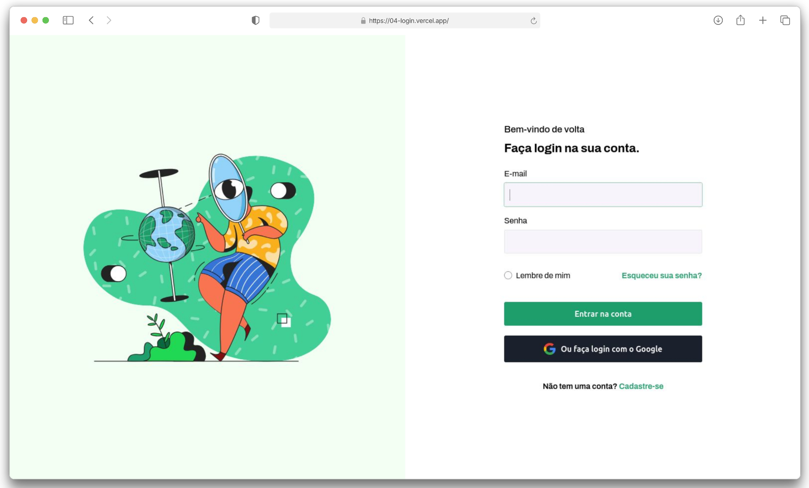

    <h1>Login 👤🔑</h1>
    

<h4 align="center"> 
    <a href="https://04-login.vercel.app/">Clique aqui para visualizar o projeto</a>
<h4>

## 💻 Sobre o projeto
Este projeto trata-se de uma página de login com uma interface limpa e intuitiva.

## 👩🏻‍💻 Funcionalidades
✅ Layout responsivo;  

## 🛠️ Tecnologias Utilizadas

Este projeto foi desenvlvido com as seguintes tecnologias e ferramentas:
* [Visual Studio Code](https://code.visualstudio.com/docs);
* [HTML](https://developer.mozilla.org/en-US/docs/Web/HTML);
* [CSS](https://developer.mozilla.org/en-US/docs/Web/CSS).

**Coded by [Ana Beatriz Arguelho](https://github.com/anabeatrizarguelho).**

