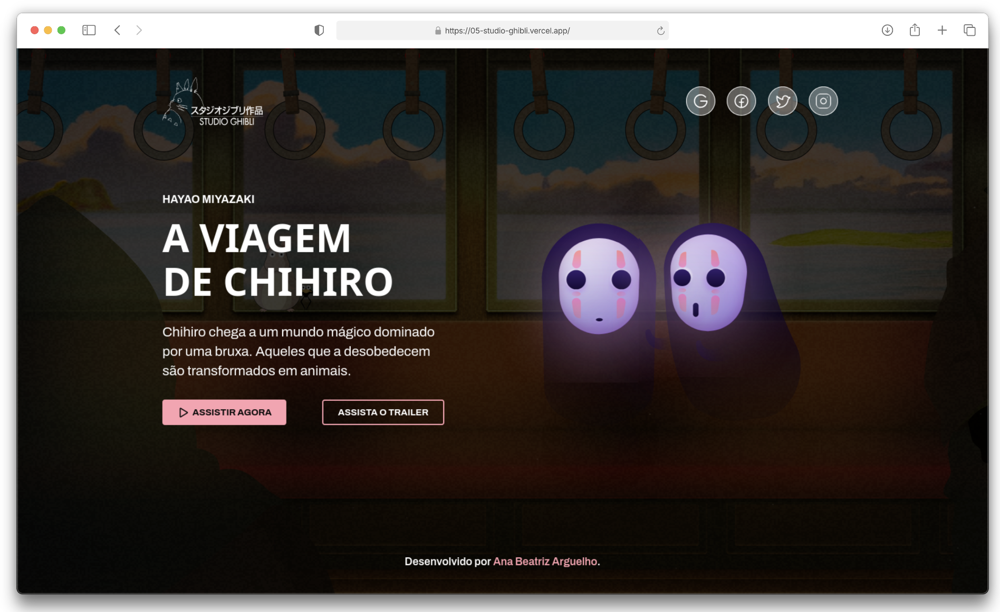

<h1 align="center">
     Studio Ghibli 👧🏻🛤️
</h1>

    

[**Clique aqui para visualizar o projeto.**](https://05-studio-ghibli.vercel.app/)

##

## 💻 Projeto
Este projeto é uma apresentação web dedicada à animação japonesa A Viagem de Chihiro (Spirited Away), produzida pelo renomado Studio Ghibli e dirigida por Hayao Miyazaki. A proposta é destacar os principais elementos visuais, narrativos e culturais dessa obra-prima da animação, explorando sua estética única, personagens marcantes e simbolismos presentes na história.

## 👩🏻‍💻 Funcionalidades
✅ Layout responsivo;  
✅ Animação de imagem flutuante;  
✅ Botões com efeito de clique.

## 🛠️ Tecnologias Utilizadas

Este projeto foi desenvlvido com as seguintes tecnologias e ferramentas:
* [Visual Studio Code](https://code.visualstudio.com/docs);
* [HTML](https://developer.mozilla.org/en-US/docs/Web/HTML);
* [CSS](https://developer.mozilla.org/en-US/docs/Web/CSS);
* [Javascript](https://developer.mozilla.org/en-US/docs/Web/JavaScript).

**Coded by [Ana Beatriz Arguelho](https://github.com/anabeatrizarguelho).**
